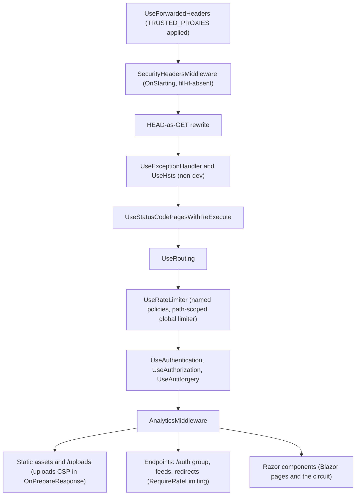

# Unit 12 — NFR Design: logical components

**Written**: 2026-09-13. The request pipeline after both phases, and where each new component sits. Details in `nfr-design-patterns.md`.

## 1. The pipeline after Unit 12

Text alternative: forwarded headers run first with the trusted-proxy lists applied; the security-headers middleware comes next and registers its fill-if-absent callback for every response; then the HEAD rewrite, the exception handler and HSTS outside Development, the status-code re-execute, routing, the rate limiter (after routing so endpoint policies resolve, before authentication so rejections never reach analytics), then authentication, authorization and antiforgery, then the analytics middleware, and finally the three sinks: static assets including `/uploads` with its own policy, the minimal-API endpoints with their policies attached, and the Razor components.

## 2. Components and their collaborators

| Component | Phase | Collaborators | State |
|---|---|---|---|
| `SecurityHeadersRules` | 12a | none | none (pure) |
| `SecurityOptions` | 12a | `IConfiguration` at startup | singleton value |
| `SecurityHeadersMiddleware` | 12a | `SecurityOptions`, `ThemeService` (snapshot hash), `SecurityHeadersRules` | none |
| `ThemeSnapshot.OverrideCssHash` | 12a | `ThemeRules.BuildSnapshot` | part of the cached snapshot |
| `App.razor` | 12a | `ThemeService` (unchanged reader); `ImportMap` removed | none |
| `ThemeEditor.razor` + `colorpicker.js` | 12a | `IJSRuntime` (`applyDataStyles`), `NavigationManager` (forced reload after save) | component state |
| `RateLimitPolicies` | 12b | `RateLimiterOptions`, `HttpContext` (client key) | limiter partitions in process memory |
| `SubmissionLimiter` and its three derivations | 12b | `TimeProvider` | per-key hit lists in process memory |
| `SubmissionRules` | 12b | `AuthEndpoints.AdminRole` | none (pure) |
| `CommentService`, `ReportService` | 12b | `CommentLimiter`, `ReportLimiter`, `SubmissionRules` | unchanged |
| `BlogPostPage.razor` → `CommentSection.razor` | 12b | the cascading `HttpContext` (client address), the two services | the island's parameters |
| `TrustedProxies` | 12b | `ForwardedHeadersOptions` at startup | none (pure) |
| `docker-compose.yml`, `.env.example`, `README.md` | both | | configuration and docs |

## 3. What talks to what, in words

The theme snapshot is the one shared object: the page head renders its override CSS and the middleware sends its hash, so the two can never disagree within a response. The forwarded-headers trust list is the other shared thing: once set, the connection address that the endpoint limiters, the circuit limiters, the contact limiter and the analytics Visitor Key all read is the trusted one. Nothing else is shared; every limiter and every rule is a small, separately tested part.
