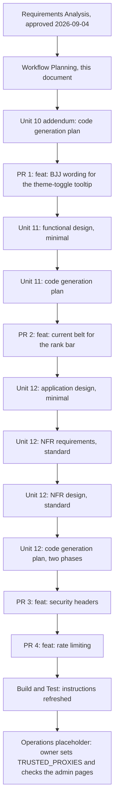

# Workflow plan: post-Unit 10 follow-ups (2026-09-04)

**Purpose**: which stages run for each of the three approved units, at what depth, in which order, and how every PR moves through the owner's execution model. **Inputs**: `inception/requirements/requirements-post-unit10-followups.md` (approved 2026-09-04; D-Q1 answered B), `construction/plans/unit10-closeout-handoff-2026-09-04.md`, `construction/unit10-bjj-landing/functional-design/business-rules.md`, the reverse-engineering artifacts. **The owner can override any recommendation below**: add a skipped stage, skip a recommended one, merge gates, change depths, reorder PRs.

## 1. Stage decisions per unit

| Unit | Stage | Run? | Depth | Why |
|---|---|---|---|---|
| Unit 10 addendum (B) | User Stories | skip | | Single owner; FR-B1 to FR-B5 enumerate the behaviour; cosmetic change |
| | Application Design | skip | | No new component: edits inside `App.razor`, `theme.js`, one pure helper, tests |
| | Functional Design | skip | | No business logic |
| | NFR Requirements, NFR Design, Infrastructure Design | skip | | Nothing non-functional changes |
| | Code Generation | run | one phase, one PR | Part 1 plan with checkboxes, Part 2 generation |
| Unit 11 (C) | User Stories | skip | | Single owner; the self-hoster case is FR-C1 and FR-C2 directly, as with Unit 10 |
| | Application Design | skip | | No new component: `RankBar`, `SiteContentEditor`, `SiteContentRules`, `BjjRules`, `SiteConfig`, `SiteContent` are extended |
| | Functional Design | run | minimal | One new data field with env fallback and default, a drawing rule per belt, the generalized degrees check, validation: `construction/unit11-current-belt/functional-design/domain-entities.md` and `business-rules.md` |
| | NFR Requirements, NFR Design, Infrastructure Design | skip | | Same stack; NFR-1 to NFR-15 apply unchanged |
| | Code Generation | run | one phase, one PR | Includes migration `AddCurrentBelt` |
| Unit 12 (D) | User Stories | skip | | No workflow changes for visitors beyond a rate-limit message |
| | Application Design | run | minimal | New components and their dependencies: header rules and middleware, nonce plumbing, rate-limit policies, the generalized fixed-window limiter, trusted-proxy parsing, circuit client-address capture: `inception/application-design/unit12-security-components.md` |
| | Functional Design | skip | | The rules are non-functional; they live in NFR Design |
| | NFR Requirements | run | standard | Threat per header, CSP directive inventory with code evidence, limiter thresholds and keys, the proxy trust boundary: `construction/unit12-security/nfr-requirements/nfr-requirements.md` and `tech-stack-decisions.md` (shared framework only; nonce versus hash; enforce versus report-only) |
| | NFR Design | run | standard | Middleware placement and order, nonce flow into `App.razor`, per-route policy for `/uploads`, 429 handling, circuit IP capture, key derivation: `construction/unit12-security/nfr-design/nfr-design-patterns.md` and `logical-components.md` |
| | Infrastructure Design | skip | | Same container; the compose `WEB_BIND` line and the `TRUSTED_PROXIES` env are configuration, covered by code generation and the README |
| | Code Generation | run | one plan, two phases | Phase 12a headers (PR 3), phase 12b rate limiting (PR 4) |
| All | Build and Test | run | refresh | Counts and fixtures in `construction/build-and-test/unit-test-instructions.md`; a new `security-verification-instructions.md` (browser CSP check, header check with curl, the owner's production admin-page check with report-only as the fallback); summary updated |
| All | Operations | placeholder | | Owner deploy-time actions recorded in the close-out handoff: `TRUSTED_PROXIES`, optionally `WEB_BIND`, the admin-page check under the CSP |

## 2. Approval gates in order

1. This plan (Inception gate).
2. Unit 10 addendum: code-generation plan; then generation complete (2-option message).
3. Unit 11: functional design; code-generation plan; generation complete.
4. Unit 12: application design; NFR requirements; NFR design; code-generation plan; phase 12a complete; phase 12b complete.
5. Build and Test complete; then the Operations placeholder.

Twelve owner approvals in total. **Override available**: Unit 12's three design documents are small and depend on each other; they can be presented together under one approval, cutting the count to ten. The recommendation is the standard sequence; pick the merged gate if you prefer fewer stops.

## 3. PR sequence

| Order | Branch | PR title (squash commit) | Size | Migration |
|---|---|---|---|---|
| 0 (owner insertion 2026-09-04) | `feat/pinned-site-header` | `feat: keep the site header pinned while scrolling` | XS | no |
| 1 | `feat/theme-toggle-bjj-tooltip` | `feat: BJJ wording for the theme-toggle tooltip` | XS | no |
| 2 | `feat/current-belt` | `feat: current belt for the rank bar` | S | `AddCurrentBelt` |
| 3 | `feat/security-headers` | `feat: security headers with an enforced content security policy` | M | no |
| 4 | `feat/rate-limiting` | `feat: rate limiting for auth, feeds, comments and reports` | M | no |

Why this order: PR 1 is trivial and closes the last box of the Unit 10 plan. PR 2 removes the last inline `style` attribute on a public page before the CSP arrives. PR 3 before PR 4 because the headers are independent of the limiter and the CSP verification is the riskiest step, best done on the smaller diff. PR 4 ends with the proxy-trust change, the only one that touches `docker-compose.yml`. Every title is a `feat:` from the CI allow-list, so release-please proposes a minor version after each merge, as it did between the Unit 10 phases.

## 4. The per-PR cycle (the execution model recorded on 2026-09-04)

1. Realign master (stash-first: `git stash push` the pending aidlc-docs edits, `git switch master`, `git fetch origin`, `git reset --hard origin/master`, `git stash pop`), then `git switch -c <branch>`. The first commit on the branch is a `docs:` commit folding every pending aidlc-docs edit (audit, state, requirements, this plan, the owner checklist, the unit's design documents).
2. One fresh Sonnet general-purpose phase agent with a self-contained brief (template: `construction/plans/unit10-phase5-brief.md`): the plan section, the design rules, the files to change, the tests to write, the definition of done (`dotnet build -warnaserror` at 0 warnings, `dotnet test` green), the report format. It ticks its plan boxes, commits by explicit path, never pushes.
3. Five review agents in parallel, report-only, fixed format: correctness and bugs; security (BR-18 grep for owner facts plus the NFR-14 checklist for Unit 12); framework awareness; maintainability; performance.
4. Remediation: a fresh agent for a long list, the orchestrator for a few one-line fixes.
5. Local verification where a requirement demands it: Unit 11 visual check of the five belts in both themes; phase 12a a browser session with zero CSP violations on the public pages listed in FR-D8; phase 12b a 429 walk-through on one limited endpoint.
6. Push; open the PR with the title above; request Copilot (`env -u GITHUB_TOKEN gh api -X POST repos/JJWren/Portfolio/pulls/N/requested_reviewers -f "reviewers[]=copilot-pull-request-reviewer[bot]"`); fix or reply on every thread; re-request until a pass adds no actionable comment; squash-merge with the title; realign; delete the branch; tick the gate box; update state, audit and memory.

## 5. Change sequence across the codebase (the map for the briefs)

- **PR 1**: `Components/App.razor` (the flavor attribute), `wwwroot/js/theme.js` (tooltip logic in the apply and toggle functions), `Services/SiteFlavorRules.cs` (a pure helper for the attribute value), `tests/Portfolio.Tests` (helper test; a text-scan test pinning the attribute usage and the two strings, with `theme.js` linked into the test output the way `app.css` is), the Unit 10 plan's deferred box ticked.
- **PR 2**: `Data/SiteContent.cs` and the migration; `Services/SiteConfig.cs`; `Services/SiteContentRules.cs` (draft, validate, resolve); `Services/BjjRules.cs` (the generalized degrees check); the effective-content type; `Components/RankBar.razor`; `Components/LandingSections.razor`; `Components/Admin/SiteContentEditor.razor`; `wwwroot/app.css`; `.env.example`; `README.md`; `CONTEXT.md`; tests in `SiteConfigTests`, `SiteContentRulesTests`, `BjjRulesTests`, `LandingSectionsRenderTests`, `AppCssTests`.
- **PR 3**: `Services/SecurityHeadersRules.cs`; `Middleware/SecurityHeadersMiddleware.cs`; `Program.cs` (middleware, Kestrel server header off, the `/uploads` policy in `OnPrepareResponse`); `Components/App.razor` (nonce on the override style block); `Components/Admin/ThemeEditor.razor` (per the NFR design); `.env.example` (`SECURITY_CSP_MODE`); `README.md`; `docs/adr/0003-security-headers-are-emitted-by-the-application.md`; tests.
- **PR 4**: `Program.cs` (rate limiter registration and placement, forwarded-headers trust); `Endpoints/AuthEndpoints.cs`, `SeoEndpoints.cs`, `AnalyticsEndpoints.cs` (policies attached); `Services/FixedWindowLimiter.cs` (generalized) with `ContactRateLimiter` kept or delegating; `Services/CommentService.cs`, `Services/ReportService.cs`; `Components/CommentSection.razor` (friendly messages); the circuit client-address capture; `docker-compose.yml` (`WEB_BIND`); `.env.example` (`TRUSTED_PROXIES`); `README.md`; tests.

## 6. Visualization

Text alternative: a single chain. Requirements Analysis (approved) leads to this Workflow Planning document; then the Unit 10 addendum's code-generation plan and PR 1; then Unit 11's minimal functional design, code-generation plan and PR 2; then Unit 12's minimal application design, standard NFR requirements, standard NFR design, a two-phase code-generation plan, PR 3 (headers) and PR 4 (rate limiting); then Build and Test refreshes the instructions; then the Operations placeholder lists the owner's deploy-time actions. Each PR runs the per-PR cycle of section 4.

## 7. Risks and how the plan handles them

- **The CSP breaks the Blazor circuit or an admin page.** `SECURITY_CSP_MODE` (enforce, report-only, off) is one env edit away; the public pages are verified in a browser before PR 3 opens; the admin pages get the owner's production check with the fallback documented in the security verification instructions.
- **A limit catches the compose health check or a shared IP.** `/healthz` and static assets are exempt; windows are generous; thresholds are code constants in one place.
- **The migration's design-time host.** Placeholders for `SITE_OWNER_NAME`, `CONTACT_EMAIL` and `ConnectionStrings__Default` as in the handoff.
- **Copilot quota.** If a review is refused for quota, the merge waits; whether to merge on the internal review alone is the owner's decision, as on 2026-09-04.
- **Losing pending doc edits on realign.** Stash first, every time.
- **Owner facts.** Every fixture invented; the security review greps for them (BR-18).

## 8. Approval

Workflow planning complete. On approval the next step is Unit 10 addendum: Code Generation Part 1 (the checkbox plan).

**Approved by the owner on 2026-09-04: "A", as written.** In the same message the owner asked for a quick change, a pinned site header; it runs first as PR 0 (requirements section 4.4, plan `construction/plans/quick-pinned-header-plan.md`, all design stages skipped, orchestrator-implemented with the five-area review and the Copilot gate), and everything else keeps its order.
