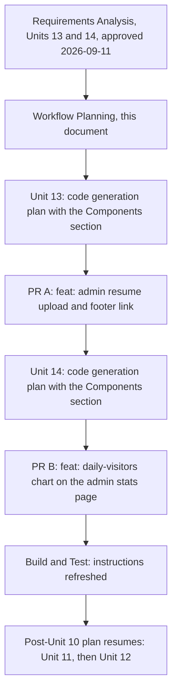

# Workflow plan: Units 13 and 14 (admin résumé upload; daily-visitors chart) (2026-09-11)

**Purpose**: which stages run for the two units approved on 2026-09-11, at what depth, in which order, and how each PR moves through the owner's execution model; and where they sit relative to the post-Unit 10 plan (`workflow-planning-post-unit10-followups.md`), whose PR 2 to PR 4 (Units 11 and 12) follow them. **Inputs**: `inception/requirements/requirements-admin-resume-upload.md` (approved 2026-09-11, "A"); `inception/requirements/requirements-admin-stats-visitors-chart.md` (approved 2026-09-11, "A", seven assumed answers included); the grilling rounds in `aidlc-docs/audit.md` under 2026-09-11; `CONTEXT.md` (Résumé, Period, Daily Visitor); `construction/plans/unit10-phase5-brief.md` (the brief template); the dataviz skill. **The owner can override any recommendation below**: add a skipped stage, skip a recommended one, merge or split gates, change depths, reorder PRs.

## 1. Stage decisions per unit

| Unit | Stage | Run? | Depth | Why |
|---|---|---|---|---|
| Unit 13 (résumé) | User Stories | skip | | Single owner; FR-R1 to FR-R14 enumerate the behaviour; the grill already walked every scenario |
| | Application Design | run | minimal, inside the code-generation plan | One new service mirroring `OwnerPhotoService` member for member (availability, file info, save, delete), one pure rules class (magic bytes, cap, origin allowlist), the footer and Contact links, the admin block; a "Components" section of the plan lists members and dependencies, approved under the plan's gate |
| | Functional Design | skip | | The rules are short and already precise in the requirements: FR-R3 (type and cap), FR-R4 (atomic write), FR-R6 (availability), FR-R10 (origin target), FR-R11 (admin exclusion) |
| | NFR Requirements, NFR Design, Infrastructure Design | skip | | NFR-16 to NFR-21 fix the constraints; the only infrastructure change (the read-write mount) is already made in the production compose file |
| | Code Generation | run | one phase, one PR | Part 1 checkbox plan with the Components section; Part 2 generation under the execution model |
| Unit 14 (chart) | User Stories | skip | | Single owner; FR-V1 to FR-V13 |
| | Application Design | run | minimal, inside the code-generation plan | One new admin component (the chart), one pure geometry and rules class, one new query on the analytics service; listed in the plan's Components section |
| | Functional Design | skip | | No business rule beyond the Period definition and the range-start rule, both in the requirements |
| | NFR Requirements, NFR Design, Infrastructure Design | skip | | NFR-22 to NFR-26 fix the constraints; no infrastructure |
| | Code Generation | run | one phase, one PR | The phase agent loads the dataviz skill first, runs its palette validator against both surfaces for the series token, and finishes with the "render and look" step in a browser before the PR opens |
| Both | Build and Test | run | refresh | `construction/build-and-test/unit-test-instructions.md` counts and fixtures refreshed inside each PR (as the Unit 10 phases did); one Build and Test gate after Unit 14 |
| Both | Operations | placeholder | | After each release: the owner bumps the compose image tag and recreates the container; for Unit 13 that recreation also activates the read-write mount already edited, then the section 8 check in the Unit 13 requirements |

## 2. Approval gates in order

1. This plan (Inception gate).
2. Unit 13: code-generation plan (with the Components section); then generation complete (2-option message).
3. Unit 14: code-generation plan (with the Components section); then generation complete.
4. Build and Test complete; then the Operations placeholder; then the post-Unit 10 plan resumes at Unit 11's functional design.

Six owner approvals. **Override available**: present each unit's Application Design as its own document under its own gate (eight approvals). The recommendation is the merged form: both design sections are a short table each, and the plan they sit in is what the phase agent is briefed from.

## 3. PR sequence

| Order | Branch | PR title (squash commit) | Size | Migration |
|---|---|---|---|---|
| A | `feat/admin-resume-upload` | `feat: admin resume upload and footer link` | S | no |
| B | `feat/admin-stats-visitors-chart` | `feat: daily-visitors chart on the admin stats page` | S | no |
| then | `feat/current-belt`, `feat/security-headers`, `feat/rate-limiting` | PR 2 to PR 4 of the post-Unit 10 plan | | as planned there |

Why this order: the owner's call (decision 10 and decision 23): résumé first, then the chart, then Units 11 and 12. Both titles are `feat:` from the CI allow-list (the check constrains only the type prefix), kept in plain ASCII so the squash commit and the release-please changelog need no escaping; the glossary's accented spelling is for visitor-facing copy and prose. Each merge lets release-please propose the next minor; two unmerged feature commits fold into one release PR if the owner does not merge in between.

## 4. The per-PR cycle

Section 4 of `workflow-planning-post-unit10-followups.md` applies unchanged: realign master stash-first, branch, a first `docs:` commit folding every pending aidlc-docs edit (audit, state, both requirements documents, both workflow plans, `CONTEXT.md`), one fresh Sonnet phase agent from a self-contained brief, five review agents in parallel, remediation, local verification, push, PR, Copilot gate, squash-merge, realign, tick, update state, audit and memory. Unit-specific local verification:

- **PR A**: a local run with a throwaway Postgres and a temporary folder as `RESUME_FILE`: the block's three states (not configured, no file, file present), an upload that replaces the file, a rejected non-PDF and an oversized file, Remove, the footer and Contact links present only when the file exists, the two download links producing "resume-download · footer" and "resume-download · contact" rows on the Stats page from a non-admin session, and no rows from the admin session.
- **PR B**: synthetic daily rows inserted into the local throwaway Postgres; the chart looked at in the Browser pane under both themes at 7, 30, 90, 365 and All time, plus the empty state with the rows removed; the palette validator's report for the chosen series token on both surfaces recorded in the plan.

## 5. Change sequence across the codebase (the map for the briefs)

- **PR A (Unit 13)**: `Services/ResumeService.cs` (new: `IsAvailable`, `GetInfo` with name, size and last write, `SaveAsync` with the magic-byte check, the cap and the atomic temp-then-move, `Delete`, `MaxBytes`); `Services/ResumeRules.cs` (new, pure: `IsPdf` over the leading bytes, `ParseOrigin` allowlisting `footer` and `contact`, size formatting); `Program.cs` (register the service); `Endpoints/AnalyticsEndpoints.cs` (`/resume` uses the availability rule and records the parsed origin as the target); `Services/AnalyticsService.cs` (`TryRecordEventAsync` skips admin principals with the same role check as the middleware); `Components/Pages/Contact.razor` (availability check, `?from=contact`); `Components/Layout/MainLayout.razor` (the footer link after Email, `?from=footer`, nav label "Links"); `Components/Admin/SiteContentEditor.razor` (the Résumé block, FR-R1 to FR-R3, FR-R7); `Components/Admin/Dashboard.razor` (card text); `wwwroot/app.css` (block styles only if the photo block's classes do not already cover it); `README.md` and `.env.example` (mount read-write wording); tests: `ResumeRulesTests`, `ResumeServiceTests` (temp directory: save, replace, reject, remove, no clobber on failure), an analytics test pinning that an admin principal records no event, rendered tests for the footer and Contact links through the existing HtmlRenderer harness where it reaches, `unit-test-instructions.md` refreshed.
- **PR B (Unit 14)**: `Services/AnalyticsService.cs` (`GetDailyVisitorsAsync(from, to)` returning one point per day with today computed live; a `DailyVisitorPoint` record); `Services/VisitorsChartRules.cs` (new, pure: range start, round-number ticks, scale, path points, the dashed final segment, the two-day threshold, date-label positions); `Components/Admin/VisitorsChart.razor` (new: inline SVG, the CSS-only hover and focus layer, the details data table, the empty state); `Components/Admin/Stats.razor` (heading, caption and component between the tiles and Top pages; the series loaded in the existing reload); `wwwroot/app.css` (chart styles in tokens, hover and focus rules, tooltip bounds, minimum height, no transitions); tests: `VisitorsChartRulesTests`, `VisitorsChartRenderTests` (HtmlRenderer with fixed points: heading, table rows, dashed segment, no script or external reference), an `AppCssTests` pin for the hover and focus rules, `unit-test-instructions.md` refreshed.

## 6. Visualization

Text alternative: a single chain. Requirements Analysis (approved) leads to this Workflow Planning document; then Unit 13's code-generation plan and PR A; then Unit 14's code-generation plan and PR B; then Build and Test refreshes the instructions; then the post-Unit 10 plan resumes with Unit 11 and Unit 12. Each PR runs the per-PR cycle of section 4.

## 7. Risks and how the plan handles them

- **The production folder is still read-only when the owner first uploads.** The mount flag is already edited; it applies on the next container recreation, which the release deploy does. Until then the block shows the write error as its message, as the photo block would.
- **Admin exclusion changes the counts.** The owner's own clicks and test submissions stop counting from the merge on; accepted in FR-R11 and noted in the requirements.
- **A PDF that is not really a PDF.** Magic bytes decide, not the extension or the declared type; the file is served as an attachment, never inline (NFR-17).
- **Chart labels collide at 365 points or the tooltip leaves the frame.** The "render and look" step in the Browser pane before the PR, at every period and both themes.
- **The series color fails contrast on one surface.** The dataviz validator runs on both surfaces before the token is chosen; a WARN obliges the visible labels and the table, which the design already has.
- **Copilot quota.** If a review is refused, the merge waits; merging on the internal review alone is the owner's decision, as before.
- **Losing pending doc edits on realign.** Stash first, every time.
- **Owner facts (BR-18).** The production filename and any real count appear in no code, test, fixture, `.env.example` or README example; the security review greps for them.

## 8. Approval

Workflow planning complete. On approval the next step is Unit 13: Code Generation Part 1 (the checkbox plan with its Components section).

**Approved by the owner on 2026-09-11: "approved", as written.** Next: Unit 13 code-generation plan (`construction/plans/unit13-admin-resume-upload-plan.md`).

**PR A done (2026-09-11)**: the admin résumé upload merged as PR #103 (b45f1f0) after two Copilot rounds (748 tests, 43 fixtures); next is the Unit 14 code-generation plan. Owner instruction the same day: continue through Unit 14 without per-gate stops, then release and deploy.
