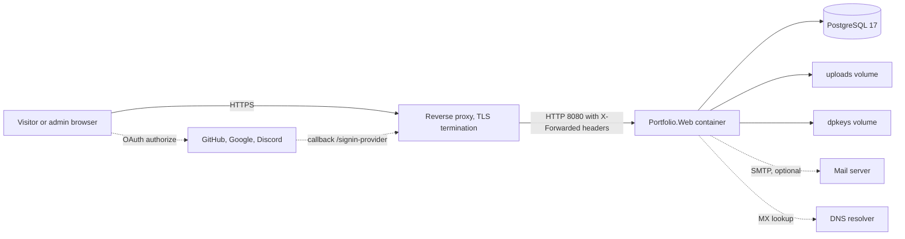
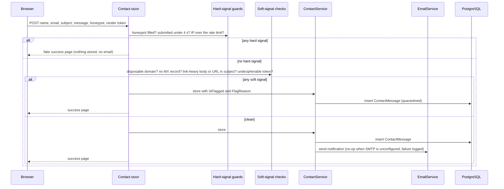
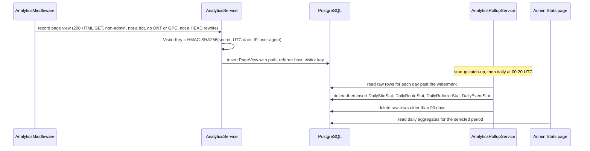

# Architecture

Snapshot at `master` @ `e1825d9` (v1.22.0). Every diagram has a text alternative directly beneath it.

## 1. Business overview

**What it is.** A self-hostable personal developer portfolio: a landing page (hero + about + skills), a projects carousel, a markdown blog with OAuth-backed comments and moderation, a contact form with an admin inbox, first-party cookieless analytics, and a hidden admin area. Everything personal comes from environment variables or admin-edited database rows, so the same container image works for anyone (`README.md`).

**Who uses it.**

| Actor | Goal | Entry points |
|---|---|---|
| Visitor | Learn who the owner is, read posts, see projects, get in touch | `/`, `/projects`, `/blog`, `/blog/{slug}`, `/contact`, `/feed.xml` |
| Reader (signed in via GitHub, Google or Discord) | Comment, report abuse, manage a display name and avatar, read moderation messages | `/signin`, `/profile`, `/messages`, `/my-reports`, the comment island on posts |
| Owner / Admin (email listed in `ADMIN_EMAILS`) | Publish posts and projects, moderate, read contact mail, edit landing copy and palette, read stats | `/admin/*` |
| Search engines and social scrapers | Index and preview pages | canonical URLs, Open Graph, JSON-LD, `/sitemap.xml`, `/robots.txt` |
| Operator | Run and upgrade the site | Docker Compose, `/healthz`, GHCR image, env vars |

**Business transactions.**

| Transaction | Trigger | Outcome |
|---|---|---|
| Visit a page | GET by a visitor | Static HTML rendered on the server; an anonymous page-view row recorded (unless bot, DNT/GPC, admin, or excluded path) |
| Read a post | GET `/blog/{slug}` | Markdown rendered through the trusted pipeline; comments island connects a SignalR circuit |
| Sign in | Provider button on `/signin` | OAuth challenge and callback; account created or linked by email; Admin role synced |
| Comment / report | Signed-in reader on a post | Comment stored (UGC pipeline on display); report stored with an excerpt snapshot |
| Moderate | Admin on `/admin/comments`, `/admin/reports` | Hide, delete, pin, ban; messages sent to users |
| Contact | Visitor submits `/contact` | Hard spam signals: fake success, nothing stored. Soft signals: quarantined message. Clean: stored and emailed |
| Click a project link / download résumé | `/go/{id}/{kind}`, `/resume` | Redirect or file plus a named event, without client-side script |
| Edit landing copy or palette | Admin on `/admin/site`, `/admin/theme` | Singleton rows updated; in-process caches cleared; every page picks up the change |
| Nightly rollup | `AnalyticsRollupService` at 00:20 UTC | Raw views and events aggregated into daily tables; raw rows older than 90 days deleted |

## 2. System context



Text alternative: the browser talks HTTPS to a reverse proxy, which forwards plain HTTP on port 8080 with `X-Forwarded-For` and `X-Forwarded-Proto` to the single `Portfolio.Web` container. The container uses PostgreSQL 17, an `uploads` volume for user images, and a `dpkeys` volume for data-protection keys. Optionally it sends mail over SMTP and performs MX lookups through DNS. OAuth sign-in redirects the browser to GitHub, Google or Discord, which call back through the proxy to `/signin-{provider}`.

## 3. Render-mode map

| Surface | Render mode | Reason |
|---|---|---|
| Every public page (`/`, `/projects`, `/blog`, `/blog/{slug}`, `/contact`, `/signin`, `/privacy`, `/terms`, `/not-found`, `/Error`) and `/admin` | Static SSR (no `@rendermode`) | Fast first paint, cacheable HTML, no circuit for anonymous traffic |
| `CommentSection` (inside post pages) | `InteractiveServer` island | Posting, paging and reporting without full-page posts |
| `/profile`, `/messages`, `/my-reports` | `InteractiveServer` | Uploads and stateful forms |
| Eleven admin pages (all except `Dashboard`) | `InteractiveServer` | Editors, sortable tables, live previews, JS interop modules |
| WebAssembly / streaming rendering | not used | No `.Client` project; no `[StreamRendering]` |

Global configuration: `AddRazorComponents().AddInteractiveServerComponents()` (`Program.cs:14-15`) and `MapRazorComponents<App>().AddInteractiveServerRenderMode()` (`Program.cs:241-242`). Enhanced navigation is on; links that must not be intercepted carry `data-enhance-nav="false"`.

## 4. Request pipeline (`Program.cs:166-243`, in order)

1. `UseForwardedHeaders` (scheme and client IP from the proxy).
2. HEAD-as-GET rewrite middleware: the method becomes GET with `Response.Body = Stream.Null`; `Items[RewrittenHeadKey]` marks it so analytics ignores it; the method is restored afterwards.
3. Non-development: `UseExceptionHandler("/Error")`, `UseHsts()`.
4. `UseStatusCodePagesWithReExecute("/not-found")`.
5. Development only: `UseHttpsRedirection()`.
6. Explicit `UseRouting()` (must follow the HEAD rewrite so GET-only endpoints match).
7. `UseAuthentication()`, `UseAuthorization()`, `UseAntiforgery()`.
8. `UseMiddleware<AnalyticsMiddleware>()` (after auth so admins are excluded).
9. `MapStaticAssets()`; `UseStaticFiles` for `/uploads` with immutable caching.
10. `MapAuthEndpoints()`, `MapSeoEndpoints()`, `MapAnalyticsEndpoints()`, `MapHealthChecks("/healthz")`.
11. `MapRazorComponents<App>().AddInteractiveServerRenderMode()`.

Before the pipeline (`Program.cs:149-164`): `db.Database.Migrate()`, Admin role creation, optional `DemoSeeder`.

Dependency injection (`Program.cs:17-45`): every application service is a singleton taking `IDbContextFactory<AppDbContext>`; a singleton-lifetime `AddDbContext` also exists for Identity stores. Both use Npgsql with `EnableDynamicJson()`.

## 5. Content pipeline (landing copy)

```text
.env (SITE_*, CONTACT_*, *_URL, RESUME_FILE, OWNER_PHOTO_*)
   │  SiteConfig.FromConfiguration (startup, validated)
   ▼
SiteConfig (singleton record)
   │                                   SiteContent row (Id=1, /admin/site)
   │                                          │
   └────────────► SiteContentRules.Resolve(site, overrides) ◄────────┘
                       │  non-null override wins per field; blank cannot force-blank env
                       ▼
                 EffectiveSiteContent  (cached in SiteContentService; version-guarded; env fallback on DB failure)
                       │
                       ▼
                 LandingSections.razor  → Home.razor (page)  and  ThemeEditor.razor (inert preview)
```

Owner photo: a single file at `OWNER_PHOTO_FILE`, served at `/owner-photo?v={ticks}` by `OwnerPhotoService`; replaced via `/admin/site` or by overwriting the mounted file. Social links are env-only.

## 6. Theme pipeline

```text
app.css :root tokens (dark default) + :root[data-theme='light'] overrides
        ▲ defaults pinned by ThemeRulesTests
ThemeRules.Tokens (26: 4 brand, 11 dark, 11 light)
        │  ThemeSettings row (Id=1, jsonb Overrides) edited at /admin/theme
        ▼
ThemeService.GetSnapshotAsync (cached; defaults on DB failure)
        │
        ├─► App.razor: <meta name="theme-color">, inline <style> with only the overridden vars, after app.css
        ├─► /site.webmanifest: background_color, theme_color
        └─► ThemeEditor preview: complete inline var set (BuildPreviewStyle) so the admin's own theme cannot leak
Visitor side: theme.js (blocking, in <head>) sets <html data-theme> from localStorage['theme'] or prefers-color-scheme; dark is the default.
```

## 7. The dual-render contract of `LandingSections`

`Components/LandingSections.razor` is rendered by `Home.razor` on `/` and by `Admin/ThemeEditor.razor` inside `<div class="theme-preview-frame" style="@_previewStyle" inert aria-hidden="true">`. Consequences for any landing change:

- The markup must look finished in its resting state: `inert` disables hover, focus and clicks in the preview.
- Nothing `position: fixed` may live in `LandingSections`; the preview frame is only `overflow: hidden`, so a fixed element would float over the admin page. Page-only chrome belongs in `Home.razor`.
- Only the 15 token vars plus `color-scheme` are set on the preview frame; other `:root` custom properties inherit, so fixed constants declared on `:root` render correctly in the preview.
- Optional sections follow the blank-hides pattern (`@if (Content.About is not null || Content.Skills.Count > 0)`), which keeps the self-hoster promise.

## 8. JavaScript model

Progressive enhancement, first-party only, no framework:

- `theme.js` runs synchronously in `<head>` before `app.css` so the first paint already has the right theme.
- `site.js` (deferred) hooks Blazor's `enhancedload` to re-apply `data-theme` (enhanced navigation re-merges server markup), close the mobile nav, localize `<time data-local>` and run Prism; a `MutationObserver` covers content rendered by interactive islands.
- Admin widgets import ES modules per circuit from `OnAfterRenderAsync` via `JsModuleUrl.Resolve(Assets[...])`, dispose with `IAsyncDisposable`, and degrade to plain controls when the import fails.
- Inline handlers exist in exactly four places (`__toggleNav`, `__toggleTheme`, `__scrollProjects` twice); they would break under a strict `script-src` CSP and are the first thing to move when security headers are added.

## 9. Deployment shape

Single container (`ghcr.io/jjwren/portfolio`) on HTTP 8080 behind a TLS-terminating reverse proxy, PostgreSQL 17 alongside, three named volumes (`pgdata`, `uploads`, `dpkeys`). Migrations run at startup. `PUBLIC_BASE_URL` must be the public origin for canonical, feed, sitemap and OG URLs. Two services (`ThemeService`, `SiteContentService`) keep in-process caches and `ContactRateLimiter` is in memory, so the design assumes exactly one replica.

## 10. Interaction diagrams

### 10.1 Landing page render

```mermaid
sequenceDiagram
  participant B as Browser
  participant M as Middleware pipeline
  participant A as App.razor
  participant H as Home.razor
  participant T as ThemeService
  participant S as SiteContentService
  participant DB as PostgreSQL
  B->>M: GET /
  M->>A: render document (static SSR)
  A->>T: GetSnapshotAsync
  T-->>A: cached snapshot, or defaults when the DB is unavailable
  A->>H: render page body
  H->>S: GetEffectiveAsync
  S->>DB: read SiteContent row (only on cache miss)
  DB-->>S: overrides
  S-->>H: env values merged with overrides
  H-->>A: LandingSections markup plus Person and WebSite JSON-LD
  A-->>B: HTML: theme.js, app.css, override style, meta, body
  M->>DB: insert PageView (AnalyticsMiddleware, 200 HTML, non-admin)
  B->>B: theme.js sets data-theme before first paint; ribbons animate
```

Text alternative: the browser requests `/`; the middleware chain hands off to `App.razor`, which reads the theme snapshot (cached, with built-in defaults if the database is down) and renders `Home.razor`; `Home` asks `SiteContentService` for the effective content, which reads the `SiteContent` row only on a cache miss and merges it over the env values; the page renders `LandingSections` and two JSON-LD blocks; the response carries the blocking theme script, the stylesheet and the admin override style; after the response, the analytics middleware records a page view; in the browser, `theme.js` sets the theme before first paint and the four ribbons play their drop animation.

### 10.2 Contact form submission with spam disposition



Text alternative: the form posts to the same page. Hard signals (filled honeypot, submission under four seconds, per-IP rate limit) produce a fake success with nothing stored. Otherwise soft signals (disposable domain, missing MX, link-heavy body or URL in subject, undecipherable render token) store the message flagged as quarantined without email. Clean messages are stored and, when SMTP is configured, emailed; an SMTP failure is logged and is not fatal because the message is already in the database. The `contact-submit` named event is recorded on success.

### 10.3 OAuth sign-in and Admin role sync

```mermaid
sequenceDiagram
  participant B as Browser
  participant A as AuthEndpoints
  participant P as OAuth provider
  participant I as Identity managers
  participant DB as PostgreSQL
  B->>A: GET /auth/login/github?returnUrl=/blog/some-post
  A-->>B: 302 challenge (unknown provider gives 404)
  B->>P: authorize
  P-->>B: 302 /signin-github with code
  B->>A: handler exchanges the code, sets the external cookie, redirects to /auth/external-callback
  A->>I: GetExternalLoginInfoAsync
  A->>I: FindByLoginAsync, then FindByEmailAsync
  alt new user
    A->>I: CreateAsync with EmailConfirmed, then AddLoginAsync
    I->>DB: insert user and external login
  end
  A->>I: refresh DisplayName; add or remove Admin role per ADMIN_EMAILS
  A->>I: SignInAsync persistent, sign out the external scheme
  A-->>B: 302 LocalRedirect(returnUrl), sanitized to this site
```

Text alternative: `/auth/login/{provider}` challenges the enabled provider with a callback of `/auth/external-callback`. After the provider redirects back, the callback reads the external login, finds the user by login and then by email (so one email across providers is one account), creates and links a new user when needed, refreshes the display name, adds or removes the Admin role according to `ADMIN_EMAILS`, signs in persistently and redirects to the sanitized `returnUrl`. Failure paths redirect to `/signin` with `error=external`, `noemail` or `create`.

### 10.4 Comment, report and moderation

```mermaid
sequenceDiagram
  participant R as Signed-in reader
  participant CS as CommentSection island
  participant CV as CommentService
  participant MD as MarkdownService UGC pipeline
  participant DB as PostgreSQL
  participant AD as Admin pages
  participant U as Reader inbox
  R->>CS: submit markdown comment over the circuit
  CS->>CV: add (ban check, length cap from CommentRules)
  CV->>DB: insert Comment (IsAnonymous from the profile default)
  CS->>MD: ToSafeHtml for display
  MD-->>CS: HTML with raw HTML disabled, images stripped, links rel nofollow ugc noopener
  R->>CS: report a comment with reason and details
  CS->>DB: insert Report with a CommentExcerpt snapshot
  AD->>DB: hide, delete or pin the comment; ban the author; send a UserMessage
  AD-->>U: outcome visible at /my-reports and /messages
```

Text alternative: comments are posted from the interactive island; the service enforces bans and length caps and stores the comment; display goes through the restricted markdown pipeline. Reports store an excerpt of the comment so context survives deletion. Admins hide, delete, pin, ban and message users from `/admin/comments` and `/admin/reports`; readers see outcomes in `/my-reports` and `/messages`.

### 10.5 Analytics capture and nightly rollup



Text alternative: after a qualifying response the middleware asks the analytics service to record a page view keyed by a daily-rotating HMAC of a per-install secret, the UTC date, the IP and the user agent, so visitors cannot be linked across days. The hosted rollup service catches up on startup and runs nightly, aggregating raw rows into permanent daily tables (idempotent delete-then-insert per day, `DailySiteStat.Day` as the watermark) and deleting raw rows older than 90 days. The admin stats page reads only the aggregates. Rationale is recorded in `docs/adr/0001-first-party-cookieless-analytics.md`.

## 11. Key architectural decisions (as found; only one has an ADR)

| Decision | Where recorded | Consequence |
|---|---|---|
| Static SSR by default, InteractiveServer per component | `Program.cs`, component headers | Fast public pages; every island holds a circuit; reconnect modal is visitor-facing on post pages |
| OAuth-only identity | `Program.cs:78-101`, `aidlc-state.md` | No passwords to protect; sign-in depends on third-party availability |
| All-singleton services with `IDbContextFactory` | `Program.cs:17-45` | Simple DI; in-process caches assume a single replica |
| Personalization by env plus admin overrides | `SiteConfig`, `SiteContent`, `ThemeSettings` | Same image for anyone; social links still require a restart |
| First-party cookieless analytics | `docs/adr/0001` | No consent banner; cross-day uniques impossible by design |
| Two markdown pipelines with an AST guard instead of an HTML sanitizer | `MarkdownService.cs`, `audit.md` 2026-07-25 | Zero extra dependency; raw HTML allowed only for admin content |
| Bundled fonts, no CDN, inline SVG icons | `app.css`, `Icon.razor`, `unit2-theming-plan.md` | Privacy claims hold; every asset ships with the image |
